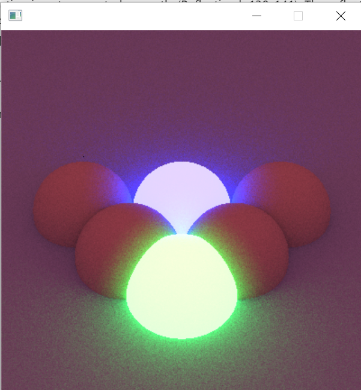
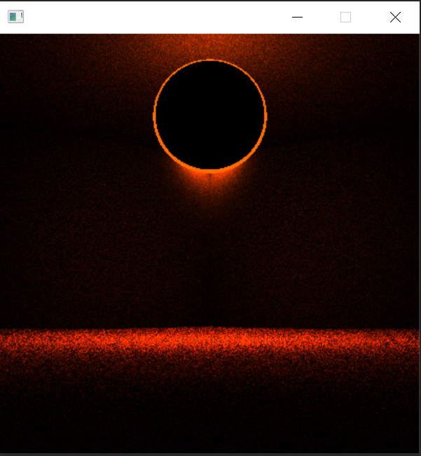

# ComputerGraphicsSamples

Repo containing many mini projects for very simple rendering with cpp

## Requisites

To run any of the projects, you need to download [SDL](https://www.libsdl.org/download-2.0.php) and put the `.dll`
and `.lib` files into a `lib` folder in the root and all the include files into the `inc` folder

## Content

### Examples

This project's aim is to create and render 3d scenes made of spheres using raytracing

## Features

### Empty

This program is the draft for other projects, as it contains all the boilerplate

### ColorsShowdown

This program creates a window drawing a emissionColor palette pixel by pixel

On the top side it's just a linear RGB palette. On the bottom side it's a gamma adjusted sRGB palette

### Cornell Box

This program creates a window drawing a Cornell box with ray tracing and simple spheres logic

### Raytracing v2 Bouncing light

This is an extension of the previous program, this time each pixel bounces till it finds a light source. This render has
128 rays per pixel

### Reflection

This is an extension of the previous program, this time the ball also reflects what's arount it

### Anti-aliasing

Starting from Raytracing 2 this applies a post process antialiasing matching near pixels.
Both images are half antialiased and half not. The difference here is the amount of rays

### Texture

The ray tracing also supports textures, which can emit and diffuse their colors

